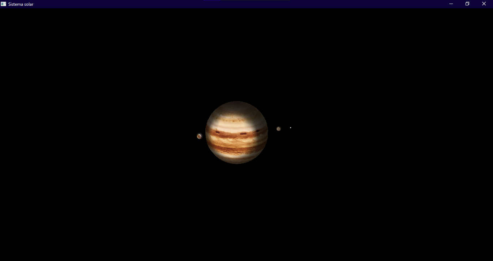

# Computer-Graphics_Solar-System

Engenharia de Computação - Segundo Período - Computação Gráfica

Integrantes do grupo:

- Emilio de Luca Canton Amaral Barbosa
- Fernando Garamvolgyi Mafra Veizaga
- Gabriel Siqueira Silva

-------------------------------------------------------------------------------------------------------------------------------------------------------------------------------------------------------------------

Comandos:
------------------------------------------
- Aperte a tecla 'C' do teclado para alternar entre as câmeras (visão lateral e visão de cima);
- Aperte a tecla 'L' do teclado para ativar/desativar a fonte de luz;
- Aperte a tecla 'O' do teclado para ativar/desativar o modo de órbitas visíveis;
- Use as setas direcionais do teclado para mover a câmera na horizontal e na vertical;
- Utilize o scroll do mouse para aumentar/diminuir o zoom da cena;
- Aperte a telca 'ESC' do teclado para fechar o programa

-------------------------------------------------------------------------------------------------------------------------------------------------------------------------------------------------------------------

Avisos para Compilação/Execução:
------------------------------------------

O projeto foi realizado em C++ e C, e portanto, para que a execução ocorra da melhor forma possível é necessário instalar as bibiotecas SDL2, para que a interface gráfica esteja ativa, e SDL2 Mixer, pois a
aplicação se utiliza de som para ambientação.

-------------------------------------------------------------------------------------------------------------------------------------------------------------------------------------------------------------------

Imagem:
------------------------------------------

***********************************
* Foco em um planeta
***********************************

***********************************
* Sem as órbitas
***********************************

***********************************
* Com as órbitas
***********************************

-------------------------------------------------------------------------------------------------------------------------------------------------------------------------------------------------------------------
